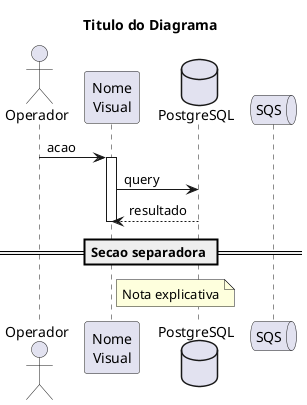

# PlantUML C4 and Sequence Reference

## Overview

Reference for PlantUML diagram syntax used in this project. All diagrams live in `docs/diagrams/` and follow C4 model conventions.

## C4 Includes

```plantuml
!include <C4/C4_Context>    ' Level 1: System Context
!include <C4/C4_Container>  ' Level 2: Containers
!include <C4/C4_Component>  ' Level 3: Components (avoid unless needed)
```

## C4 Quick Reference

| Function | Purpose | Example |
|----------|---------|---------|
| `Person(alias, label, desc)` | External user | `Person(user, "Operador", "Gerencia produtos")` |
| `System(alias, label, desc)` | Internal system | `System(catalogo, "Catalogo", "CRUD de produtos")` |
| `System_Ext(alias, label, desc)` | External system | `System_Ext(sns, "SNS", "Mensageria")` |
| `System_Boundary(alias, label)` | Grouping | `System_Boundary(svc, "Catalogo Service") { ... }` |
| `Container(alias, label, tech, desc)` | Container | `Container(api, "FastAPI", "Python", "Rotas HTTP")` |
| `ContainerDb(alias, label, tech, desc)` | Database | `ContainerDb(db, "PostgreSQL", "Banco relacional", "...")` |
| `ContainerQueue(alias, label, tech, desc)` | Queue | `ContainerQueue(sqs, "SQS", "AWS", "Fila de eventos")` |
| `Rel(from, to, label, tech?)` | Relationship | `Rel(api, uc, "Chama")` |

## Sequence Diagram Quick Reference



**Participant types:** `actor`, `participant`, `database`, `queue`, `collections`, `entity`

## Project Conventions

- File naming: `c4-{level}-{subject}.puml` or `sequence-{action}-{variant}.puml`
- All text in Portuguese without accents (PlantUML compatibility)
- Title on every diagram
- Use `activate/deactivate` for lifelines in sequence diagrams
- Use `== Label ==` for async boundaries (ex: "Processamento assincrono")
- Generate PNG: `plantuml docs/diagrams/*.puml`

## Common Mistakes

- Forgetting `@startuml` / `@enduml` tags
- Using accents in identifiers (use only in strings/labels)
- Missing `!include` for C4 macros
- Nesting `System_Boundary` inside `System_Boundary` (not supported in C4)
